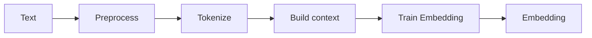
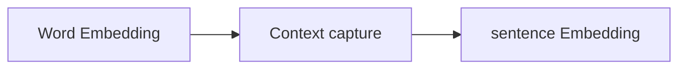
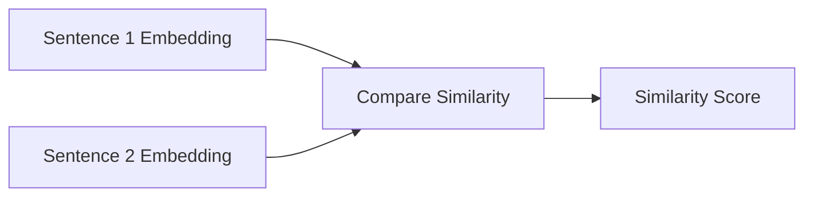

  
  
  
  
  

This project explores how machines can understand when two sentences mean the same thing, even if they use different words.
Using word and sentence embeddings, we built models that capture semantic equivalence beyond simple keyword overlap.
We compare classical baselines with Siamese LSTM and BiMPM architectures on the Quora Question Pairs dataset.

## When Meaning Matters More Than Words

Human language enables people to convey the same meaning (semantic equivalence) in numerous ways, such as through different words, sentence structures, or regional phrasing.
For instance:

> "Which smartphone takes the best photos?"  
> "What phone has the highest camera quality?"

Both questions convey the exact intent yet share only a few words in common.
This variation extends across regions as well:

> 🇬🇧 "Can we bring the meeting forward?"  
> 🇺🇸 "Can we move the meeting up?"  
> 🇮🇳 "Can we prepone the meeting?" (Indian English for 'move earlier')

Humans effortlessly recognize these as identical in meaning.
For machines, however, this semantic equivalence is far from obvious.
The ability to detect such equivalence offers several key advantages:

- **Improved Search**: Groups sentences or documents with the same meaning, making it easier for users to find all relevant answers in one place and helping writers reach a broader audience.

- **Smarter Chatbots**: Recognizes when users phrase the same question in different ways, enabling more natural and accurate responses.

- **Deeper Language Understanding**: Supports advanced tasks such as summarization, comparison, and translation by capturing the true meaning behind words and phrases.

The challenge is to build an algorithm that compares **meaning**, not just match words.

## Comparing Meaning is a Two-Step Process

The basic structure of algorithms measuring semantic similarity follows a straightforward process: first, represent the meanings of sentences or phrases in a form that machines can process; second, compare these representations to evaluate similarity.
This goal has two steps.

1. **<u>Representation: Turning Meaning into Numbers</u>**
   Machines don't understand words directly, so the first step is to represent language as numbers.
   This step converts words and sentences into numerical forms that preserve their meaning, often using data from documents, web pages, or dictionaries.

2. **<u>Comparison: Measuring the Similarity Between Meanings</u>**

Comparison concerns how these representations are evaluated to measure similarity.
It determines whether two sentences express ideas that are close in meaning, even if their words differ.

### Representation of Words

> The goal of representation is to convert raw text into numerical form so that machines can capture and reason about meaning.

<em>Figure 1. The steps of converting raw text to machine representation.</em>

As shown in Figure 1, the steps are as follows:

1. **Collect and Prepare Text Data**
   - Gather a large text corpus (e.g., Wikipedia, news, or domain-specific data).
   - Clean the text by removing punctuation, numbers, and special symbols.
   - Convert to lowercase and optionally remove stopwords.

2. **Tokenization**
   - Split text into smaller units (**tokens**) such as words, subwords, or characters.

     | Tokenization Type   | Example Tokens                                              | Description                                                                                                                    |
     | ------------------- | ----------------------------------------------------------- | ------------------------------------------------------------------------------------------------------------------------------ |
     | **Word-level**      | `["The", "king", "ate", "an", "apple"]`                     | Treats each word as a separate token. Simple and intuitive, but fails on rare or unseen words.                                 |
     | **Character-level** | `["T", "h", "e", " ", "k", "i", "n", "g", ...]`             | Splits text into individual characters. Helps handle typos but loses word-level meaning.                                       |
     | **Subword-level**   | `["The", "king", "ate", "an", "app", "le"]`                 | Breaks rare words into frequent parts (e.g., _"app"_ + _"le"_). Handles vocabulary growth efficiently.                         |
     | **n-gram tokens**   | _Bigrams:_ `["The king", "king ate", "ate an", "an apple"]` | Combines _n_ consecutive words to capture local context and co-occurrence patterns. Vocabulary grows quickly as _n_ increases. |

      
<em>Table 1. Tokenization of words.</em>

     Each method reflects a trade-off between granularity (how small the pieces are) and context capture (how much relational meaning is retained).

   - Build a **vocabulary**, the list of all unique tokens in the dataset.

3. **Define Context**
   Decide how words "co-occur" in sentences, for example
   - **Word2Vec:** Uses a sliding context window around each word.
   - **GloVe:** Builds a co-occurrence matrix counting how often words appear together.

4. **Train the Embedding Model**
   Learn numeric representations that capture semantic relationships between words.
   This means that words with similar meanings are placed close together in vector space.
   Common algorithms include:
   - Word2Vec: Learns by predicting a word from its surrounding context using a shallow neural network (CBOW or Skip-gram).
   - GloVe: Learns by reconstructing how frequently words appear together across the entire text corpus using weighted least-squares regression.
   - FastText / BERT: Learn richer subword or contextual embeddings that consider how a word's meaning changes depending on the sentence (used in transformer-based models).

5. **Extract and Store Embeddings**
   - Save the learned vectors (e.g., 300-dimensional arrays).
   - Each word is represented as a numerical vector capturing meaning:

> "king" → [0.21, 0.35, -0.14, ...]
>
> "queen" → [0.19, 0.36, -0.12, ...]

### Representation of Sentences: Meaning Beyond Words

After converting each word into numbers, the next step is to understand how words combine to form the meaning of a sentence.

Words depend on context — the same word can mean different things.
For example:

- In "apple pie," apple means food.
- In "Apple released a new iPhone," it means the company.

While embeddings capture word meaning, we also need to capture how words relate to each other in a sentence.
For instance, "The king ate an apple" and "The queen ate a fruit" express similar ideas even though they use different words.

Some simple approaches include:

- Averaging word embeddings: take the mean of all word vectors in a sentence.
- Weighted averaging: give more importance to key words (e.g., nouns or verbs).
- Concatenation: join word vectors in order (valid for short phrases).

These basic methods ignore word order and context.
A slight improvement over simple averaging is the **moving average**, which smooths each word's meaning with that of its nearby words using a sliding window.

Formally, for a target word \( w_t \) in a sentence, its contextual representation can be estimated by averaging the embeddings of the words within a surrounding window of size \( W \):

$$
\tilde{\mathbf{e}}(w_t) = \frac{1}{2W+1}\sum_{j=t-W}^{t+W}\mathbf{e}(w_j)
$$

This approach captures limited local context by blending information from neighboring words, providing a smoother representation without requiring a complex model.

While the moving average captures only local context, it cannot understand word order or long-range meaning.
To model how information flows across a sentence, we use sequential models such as Recurrent Neural Networks and their improved form, the Long Short-Term Memory (LSTM) network.

<em>Figure 2. The steps of obtaining a machine representation of sentences.</em>

Hence, after word embedding, the next step is to model how words relate to one another in a sequence, so that the overall meaning of a sentence or phrase can be understood.

### Metrics to measure sentence similarity

Once sentence embeddings are obtained, the next step is to compare the similarity between two sentences.
Several metrics can be used for this purpose, such as cosine similarity, Euclidean distance, or Manhattan distance, each providing a way to measure the degree of semantic similarity between sentence vectors.

## How We Taught the Model to Compare Meaning

In this study, we focused on addressing three key challenges:

- How to handle cases where sentences contain words **missing from existing dictionaries or pretrained embeddings**.

- How to **design a pipeline** that uses existing word embeddings and captures **local context** to produce **sentence-level representations** capable of distinguishing whether two sentences convey similar meanings.

We evaluated and compared several modeling strategies:

1. **Classical Machine Learning Baselines**
   Used handcrafted features derived from **GloVe** or **Word2Vec** embeddings
   Unknown words were ignored, and classification was performed using: **Logistic Regression**, **Random Forest**, **SVM**, **AdaBoost**, and **XGBoost**.

2. **Siamese Manhattan LSTM**
   Two identical **LSTMs** process the two questions in parallel, and their outputs are compared using the **Manhattan distance**.
   This model uses **Word2Vec** embeddings with **custom handling for missing words**.

3. **Bilateral Multi-Perspective Matching (BiMPM)**
   An advanced architecture using **bidirectional LSTMs** for contextual encoding.
   Each word in one question is matched with all words in the other using **multi-perspective cosine similarity**, followed by **aggregation via BiLSTM** and a **softmax classifier**.

4. **GloVe + LSTM + CNN + Baseline Features**
   Combines **GloVe embeddings (trained on 840B tokens)** with multiple feature extraction branches: - **LSTM** with 256 hidden units - **1D CNN** (kernel size = 11, stride = 1, 256 filters, leaky ReLU activation) - **Mean pooling** of embeddings
   These extracted features are concatenated with baseline features and passed through **five fully connected layers** with dropout and batch normalization.

We used the Kaggle Quora Question Pairs challenge, which contains millions of labeled question pairs (is_duplicate = 0/1) and uses Log Loss as the evaluation metric (computed via Kaggle submission).

**Results Summary**

| Model                                  | Log-loss ↓ | Notes                               |
| -------------------------------------- | ---------- | ----------------------------------- |
| Majority baseline                      | 0.55       | Random guess baseline               |
| XGBoost + baseline features            | 0.38       | Best traditional                    |
| Siamese LSTM                           | 0.40       | Noise due to unknown-word embedding |
| BiMPM                                  | 0.34       | Strong contextual model             |
| GloVe + LSTM + CNN + baseline features | 0.21       | Best performing model               |

## Further read

- 📄 <a href="/assets/js/pdfjs/web/viewer.html?file=/assets/reports/siamese_lstm/report.pdf" target="_blank">Full Technical Report</a>
