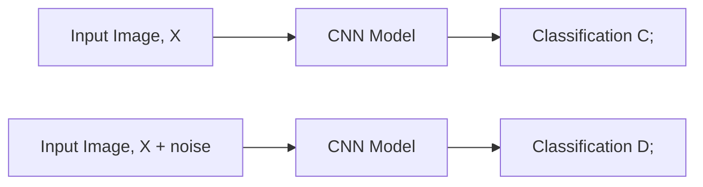

  
  
  
  
  
  
  
  

This work studies how convolutional neural networks (CNNs) use different frequency parts of an image.
We found that many adversarial weaknesses come from the model's strong use of high-frequency details that humans barely notice.
Our results show that adversarial attacks mainly change the high-frequency parts of images.
At the same time, robust or adversarially trained models rely more on low-frequency information.
This shift makes them more stable and harder to fool.

## Byte-sized Attacks: How Small Changes Break Intelligent Systems

In May 2017, the WannaCry ransomware outbreak (a computer virus) swept across the world, infecting over 200,000 computers in more than 150 countries.
Hospitals, shipping networks, and government agencies were paralyzed overnight.
The virus was just a few kilobytes of malicious code that exploited a hidden weakness in the Windows OS.
This shows that complex systems can fail because of tiny, hidden flaws.

Now imagine a world where most daily activities are governed by complex AI models.
What happens when these systems start making wrong, even harmful, predictions or decisions, even though they are trained carefully?
In one well-known example, researchers showed that by altering just a few bytes in a trained model, a state-of-the-art self-driving car misread a stop sign as "Speed Limit 45."
A small sticker of a few pixels was enough to fool a billion-dollar system .

This is why it becomes crucial to understand when and how pre-trained models, despite having multiple safeguards during training, can still be fooled so easily.
Such investigations fall under the field of adversarial attacks, which study deliberate manipulations designed to expose the hidden weaknesses of AI systems.

## When Small Noise Fools Big Models

Machine learning models are primarily trained to work on specific problems, under the assumption that the training and test data are generated from the same statistical distribution.
In Adversarial attacks, a deliberate attempt is made to deceive the models by introducing subtle, often invisible, changes to their input.
These changes are crafted so carefully that they appear harmless to the human eye.
Yet, they completely alter how the model interprets the data.

A classic demonstration comes from researchers at Google Brain, who showed that adding a barely perceptible noise pattern to a picture of a panda made a highly accurate image classifier label it as a gibbon with over 99% confidence .

    

        
    

The classic "panda–gibbon" adversarial example from Goodfellow et al. (2014) .
A small, imperceptible perturbation is added to the original image of a panda.
To humans, the result looks identical, but the neural network's prediction changes from "panda" to "gibbon".
This striking example illustrates how tiny, structured noise can completely mislead a deep learning model.

Workflow of the adversarial attack used in the example above.

Hence, it is essential to understand how and when these models can be vulnerable so that they can be designed for safety in the future.

## Towards Frequency-Based Explanation for Robust CNN

In our study, we explored why deep neural networks become vulnerable to small, imperceptible perturbations by analyzing their behavior in the frequency domain rather than the traditional pixel (spatial) domain.

  

    
  

 Online lecture on our work to better identify algorithms that are vulnerable to these attacks and present explainable options to help design better models. To read in more detail refer 

We showed that adversarial perturbations—whether crafted by white-box or black-box attacks—primarily distort the high-frequency components of an image, which humans hardly perceive.
Through a series of experiments on CIFAR-10 with ResNet and VGG models, we discovered that standard CNNs rely heavily on these high-frequency features to make predictions.
This dependence explains why they can be easily fooled by minute, structured noise.

To quantify this relationship, we proposed the Occluded Frequency (OF) method, a new way to measure how much each frequency band affects model predictions.
Our analysis revealed that robustly trained models (via adversarial training) shift their reliance toward low-frequency components, which are more correlated with accurate semantic content and less sensitive to noise.

These findings offer a new, interpretable explanation for robustness:

> A model becomes more resilient when it learns from stable, low-frequency information rather than fragile, high-frequency cues.

This perspective bridges adversarial machine learning and signal processing, providing a frequency-based framework for explaining and improving CNN robustness, an essential step toward transparent and trustworthy AI systems.

## Further read

- 📄 [Complete Article](https://arxiv.org/pdf/2005.03141)
